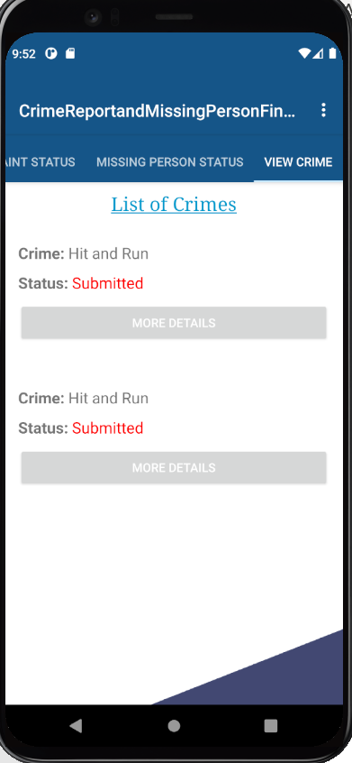

# AndroidGroup10
## Crime Report and Missing Person Finder Application  
## Team Members : Madhu Babu Konda, Gahana Swetha Sanagala, Rohit Reddy Chandupatla
The purpose of our application is to find the different crimes and people missing in a particular area according to the zip code. This application can have two different authorizations one is the user and another is the admin. A user can file and view a crime report, search and add if a person if missing where as the admin has the access to update the complains and keep a track on all the crimes and missing cases.
## Activities:   Main Screen consists of the following screens.
### (i)	DASHBOARD
•	This is main home page for this application which contains three buttons Crimes Around You, Missing People, Login.

### (ii)	CRIMES AROUND YOU 
•	By the zip code user can find the crimes which are registered among the area by all details of the crime like name of the crime with the image.

### (iii)	MISSING PEOPLE
•	In this user can find the missing people who are registered in the app with their all details like Name, Age, Id, Address,  Image and Status of the complaint.

### (iv)	LOGIN (User)
•	In this user can sign in by creating an email and password and they can register the complaints of missing people, crime around you with all the details including images also they the check the status of the complaints which is updated by admin.

### (v)	LOGIN (Admin) 
•	By giving the email and password the admin can register into the admin pages their admin can view all complaints, crimes, missing people options by pressing them individually each one consists of lists of views according to the options.
•	And admin can update the status of the complaint which is verified or/ still /in progress.

### Supported Devices:
It can support OS ranging from Android 11.0(R) to Android 5.0(lollipop)
## APK
##### [Download our APK here!](https://github.com/Rohitreddz/Crime-Report-and-Missing-Person-Finder-Application/blob/master/CRMPF.apk)

## Our app screens

## (ii)	CRIMES AROUND YOU 

## (iii) MISSING PEOPLE

### (iv) LOGIN (User)

### (v)	LOGIN (Admin) 

## Sequence Information:

### ER Diagram

## Class Diagram

